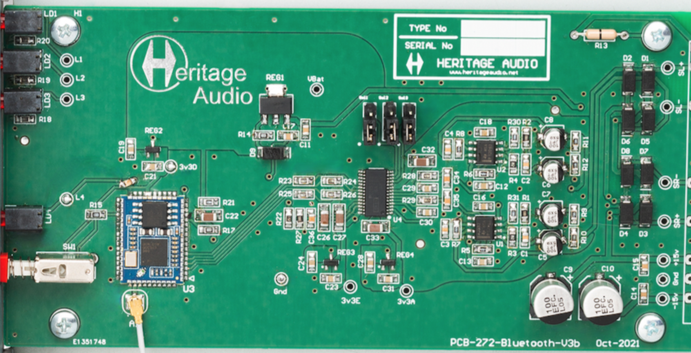

# Project GDrive 2 Markdown Sync
This is a test to see if I can sync this with gdrive and have the files automatically uploaded to Gdrive. Will this work?

* The goal here is to store these files in a directory that is sync'ed to gdrive, and all of the files and images are synced up to Gdrive.
* all images should probably be put in a subdirectory so they don't clutter up the files.
* The intention here is to link this directory to Gdrive - and see if the files will automatically upload.